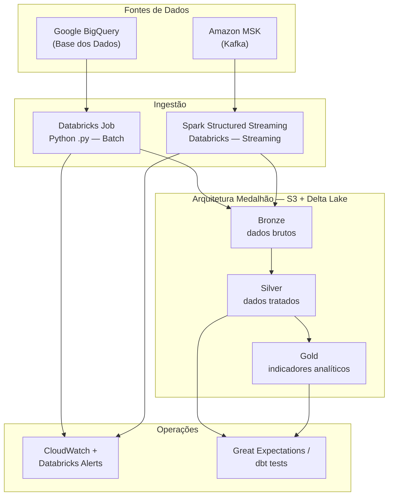

# Pipeline Híbrido — Análise da Alfabetização no Brasil

Tech Challenge Fase 2 — Pipeline de dados híbrida (Batch + Streaming) com Arquitetura Medalhão, integrando fontes educacionais da [Base dos Dados](https://basedosdados.org) para análise do programa Compromisso Nacional Criança Alfabetizada.

---

## Visão Geral da Arquitetura



---

## Stack Tecnológica

| Camada | Tecnologia |
|---|---|
| Fonte de dados | Google BigQuery (Base dos Dados) |
| Ingestão Batch | Databricks Jobs (Python `.py`) |
| Ingestão Streaming | Amazon MSK (Kafka) + Spark Structured Streaming |
| Storage | AWS S3 + Delta Lake |
| Orquestração | Databricks Workflows |
| Credenciais GCP | Databricks Secret Scope |
| Credenciais AWS | Databricks Secret Scope (Serverless) + IAM Instance Profile (cluster clássico) |
| Qualidade de dados | Great Expectations / dbt tests *(pendente)* |
| Monitoramento | CloudWatch + Databricks email alerts |
| IaC | Terraform |

---

## Estrutura do Projeto

```
tech-challenge-2/
├── ingestion/
│   └── batch/                      ← Ingestão batch (implementado)
│       ├── config.py               ← Parâmetros centralizados
│       ├── connections/
│       │   ├── bigquery_client.py  ← Cliente GCP via Databricks Secrets
│       │   └── spark_s3.py         ← SparkSession com IAM Instance Profile
│       ├── sources/
│       │   ├── base_source.py      ← Classe abstrata + retry
│       │   ├── uf.py
│       │   ├── municipio.py
│       │   ├── meta_brasil.py
│       │   ├── meta_uf.py
│       │   ├── meta_municipio.py
│       │   └── alunos.py
│       ├── bronze_writer.py        ← Gravação Delta Lake no S3
│       └── main.py                 ← Entry point do Databricks Job
├── tests/
│   └── batch/
│       ├── conftest.py
│       └── test_sources.py
├── terraform/                      ← IaC AWS + Databricks Job
│   ├── README.md
│   ├── main.tf
│   ├── modules/
│   │   ├── s3_datalake/
│   │   ├── iam_databricks/
│   │   └── databricks_job/
│   └── terraform.tfvars.example
├── requirements.txt
└── README.md
```

---

## Camada Bronze — Ingestão Batch (Implementado)

### Fontes integradas

| Fonte | Tabela BigQuery | Destino S3 |
|---|---|---|
| UF | `basedosdados.br_bd_diretorios_brasil.uf` | `bronze/.../uf/` |
| Município | `basedosdados.br_bd_diretorios_brasil.municipio` | `bronze/.../municipio/` |
| Meta Brasil | `basedosdados.br_inep_avaliacao_alfabetizacao.meta_alfabetizacao_brasil` | `bronze/.../meta_brasil/ano=XXXX/` |
| Meta UF | `basedosdados.br_inep_avaliacao_alfabetizacao.meta_alfabetizacao_uf` | `bronze/.../meta_uf/ano=XXXX/` |
| Meta Município | `basedosdados.br_inep_avaliacao_alfabetizacao.meta_alfabetizacao_municipio` | `bronze/.../meta_municipio/ano=XXXX/` |
| Alunos | `basedosdados.br_inep_avaliacao_alfabetizacao.alunos` | `bronze/.../alunos/ano=XXXX/` |

### Metadados adicionados em cada registro

| Coluna | Descrição |
|---|---|
| `_ingestion_timestamp` | Data/hora UTC da ingestão (ISO 8601) |
| `_source_table` | Tabela de origem no BigQuery |
| `_batch_id` | UUID único do lote de ingestão |

### Layout S3 (Bronze)

```
s3://tech-challenge-2-datalake/
└── bronze/
    └── br_inep_alfabetizacao/
        ├── uf/
        ├── municipio/
        ├── meta_brasil/
        │   ├── ano=2023/
        │   └── ano=2024/
        ├── meta_uf/
        │   ├── ano=2023/
        │   └── ano=2024/
        ├── meta_municipio/
        │   ├── ano=2023/
        │   └── ano=2024/
        └── alunos/
            ├── ano=2023/
            └── ano=2024/
```

---

## Configuração de Credenciais

### 1. GCP — BigQuery (Databricks Secret Scope)

```bash
# Criar Secret Scope "gcp" via Databricks CLI
databricks secrets create-scope gcp
databricks secrets put --scope gcp --key project-id \
    --string-value "YOUR_GCP_PROJECT_ID"
databricks secrets put --scope gcp --key service-account-json \
    --string-value "$(cat service-account.json)"
```

Variáveis de ambiente relevantes:

| Variável | Padrão | Descrição |
|---|---|---|
| `GCP_PROJECT_ID_SECRET_KEY` | `project-id` | Chave do Secret Scope para o project ID |
| `DATABRICKS_SECRET_SCOPE` | `gcp` | Nome do Secret Scope |
| `DATABRICKS_SECRET_KEY` | `service-account-json` | Chave do JSON da service account |

**Fallback para desenvolvimento local:**
```bash
# Opção 1 — arquivo
export GOOGLE_APPLICATION_CREDENTIALS="/caminho/para/service-account.json"

# Opção 2 — JSON inline
export GCP_SERVICE_ACCOUNT_JSON='{"type":"service_account",...}'
```

### 2. AWS — S3

#### Serverless (produção atual)

O batch Bronze em **Databricks Serverless** usa credenciais via **Secret Scope** (IAM User + access keys provisionados pelo Terraform):

```bash
databricks secrets create-scope aws
databricks secrets put --scope aws --key s3-bucket --string-value "YOUR_BUCKET_NAME"
databricks secrets put --scope aws --key access-key-id --string-value "AKIA..."
databricks secrets put --scope aws --key secret-access-key --string-value "..."
```

Após `terraform apply`, use os comandos documentados em [`terraform/README.md`](terraform/README.md).

| Secret Scope | Chave | Descrição |
|---|---|---|
| `aws` | `s3-bucket` | Nome do bucket S3 |
| `aws` | `access-key-id` | Access key do IAM User |
| `aws` | `secret-access-key` | Secret key do IAM User |

#### Cluster clássico (Instance Profile)

Para clusters clássicos ou streaming futuro, associe o **Instance Profile** criado pelo Terraform (`tech-challenge-2-<env>-databricks-s3-profile`) ao cluster Databricks. A política S3 mínima:

```json
{
  "Effect": "Allow",
  "Action": ["s3:PutObject", "s3:GetObject", "s3:ListBucket", "s3:DeleteObject"],
  "Resource": [
    "arn:aws:s3:::YOUR_BUCKET_NAME",
    "arn:aws:s3:::YOUR_BUCKET_NAME/*"
  ]
}
```

Variáveis de ambiente relevantes:

| Variável | Padrão | Descrição |
|---|---|---|
| `S3_BUCKET` | *(via Secret Scope)* | Bucket de destino |
| `BRONZE_PREFIX` | `bronze/br_inep_alfabetizacao` | Prefixo da camada Bronze |
| `AWS_DEFAULT_REGION` | `us-east-1` | Região AWS |
| `S3_ENDPOINT` | *(vazio)* | Endpoint alternativo (MinIO / LocalStack) |

---

## Como Executar

### Instalação local (desenvolvimento)

```bash
python -m venv .venv
source .venv/bin/activate
pip install -r requirements.txt
```

### Testes unitários

```bash
pytest tests/batch/ -v
```

### Databricks Job (produção)

**Task type:** Python script
**Caminho:** `ingestion/batch/main.py`

```bash
# Ingerir todas as fontes, anos 2023 e 2024
python -m ingestion.batch.main --sources all --years 2023,2024

# Fontes específicas
python -m ingestion.batch.main --sources uf,meta_brasil --years 2024

# Modo desenvolvimento — limitar linhas por fonte
python -m ingestion.batch.main --sources meta_municipio --years 2024 --row-limit 10000

# Modo append (preserva dados existentes)
python -m ingestion.batch.main --sources alunos --years 2024 --append
```

### Databricks Widgets (alternativa via UI)

| Widget | Exemplo | Descrição |
|---|---|---|
| `sources` | `all` | Fontes separadas por vírgula ou `all` |
| `years` | `2023,2024` | Anos a ingerir |
| `batch_id` | *(vazio)* | UUID gerado automaticamente se vazio |
| `row_limit` | `10000` | Limite de linhas (vazio = sem limite) |
| `overwrite` | `true` | `false` para modo append |

---

## Boas Práticas Aplicadas (Batch Bronze)

- Scripts Python versionáveis (sem notebooks em produção)
- Credenciais via Databricks Secret Scope e IAM (zero secrets hardcoded)
- Classe base com contrato, retry exponencial e logging padronizado
- Configuração centralizada desacoplada de código
- Metadados de auditoria (`_ingestion_timestamp`, `_source_table`, `_batch_id`)
- Particionamento Delta Lake por `ano` para leituras seletivas nas camadas Silver/Gold
- Validação de schema mínimo antes da gravação
- Testes unitários com mocks — sem dependência de serviços de nuvem
- Parametrização via CLI e Databricks Widgets

---

## FinOps — Otimização de Custos da Arquitetura

Práticas de **FinOps** do pipeline híbrido (Batch + Streaming) com arquitetura
Medalhão (Bronze → Silver → Gold) em **AWS S3 + Delta Lake + Databricks**.

O objetivo é minimizar o custo total de propriedade (TCO) sem comprometer
rastreabilidade, qualidade e latência analítica exigidas pelo Compromisso
Nacional Criança Alfabetizada.

Estimativa monetária detalhada: [`docs/finops-estimativa-custos.md`](docs/finops-estimativa-custos.md).

### Princípios adotados

| Princípio | Como aplicamos |
|---|---|
| Pagar pelo uso | Databricks Jobs **Serverless** (sem cluster ocioso) |
| Armazenar barato, processar sob demanda | S3 + Delta (Parquet/Snappy) + lifecycle por camada |
| Ler só o necessário | Particionamento + predicate pushdown + projeção de colunas |
| Separar hot/cold | Bronze envelhece para STANDARD_IA; Silver/Gold ficam hot |
| Qualidade com custo controlado | Quarentena Delta append-only; DLQ Bronze em modo lean (log only) |
| Observabilidade de custo operacional | CloudWatch (duração, volume, falhas, quarantine/pass rate) + alertas SNS |

### 1. Uso eficiente de armazenamento

- **Formato colunar**: Delta Lake sobre **Parquet + compressão Snappy** — reduz volume em ~60–80% vs CSV/JSON e habilita leitura parcial de colunas.
- **Particionamento**:
  - Bronze: `ano` (alinhado ao ciclo do Censo/SAEB e às metas INEP).
  - Silver: `ano` (+ `sigla_uf` quando houver consulta regional frequente).
  - Gold: `ano` (e `sigla_uf` quando houver drill-down estadual).
  - Quarentena: `ano` quando a coluna existir (`quarantine/br_inep_alfabetizacao/{layer}/{entity}`).
- **Evitar over-partitioning**: não particionamos por `id_municipio`/`id_aluno` (alta cardinalidade → small files e custo de LIST no S3).
- **Ciclo de vida (S3 Lifecycle via Terraform)**:
  - Prefixo `bronze/` → **STANDARD_IA após 90 dias** (dados brutos raramente relidos após a promoção para Silver).
  - Abort de multipart uploads incompletos em 7 dias (evita lixo cobrado).
  - Silver/Gold permanecem em STANDARD (acesso analítico frequente).
  - Prefixo `quarantine/` ainda sem lifecycle dedicado — monitorar crescimento e, se necessário, aplicar IA/expiração (recomendação FinOps).
- **Idempotência com overwrite por partição**: reprocessamentos não duplicam histórico descontrolado; reduz crescimento silencioso do lake.
- **Quarentena vs DLQ (trade-off FinOps)**:
  - Silver/Gold: linhas inválidas vão para **Delta em S3** (append) — custo de storage baixo, mas cresce se a taxa de rejeição for alta.
  - Bronze streaming: eventos malformados ficam em **DLQ lean (somente log)** — não persistem payload no S3, evitando custo de armazenamento de lixo.

### 2. Otimização de queries (evitar full scans)

- **Filtro na origem (BigQuery)**: `WHERE ano IN (...)` antes do transfer — reduz *bytes billed* na GCP e o volume ingressado no S3.
- **Predicate pushdown / partition pruning**: leituras Silver/Gold devem aplicar filtros de `ano` (e `sigla_uf`) **antes** de materializar em memória, evitando carregar a tabela inteira.
- **Column pruning**: jobs Gold selecionam apenas colunas analíticas (`taxa`, `peso_aluno`, chaves territoriais), não o payload completo de microdados.
- **Agregação na Gold**: indicadores municipais/UF são pré-calculados; o consumo analítico não precisa varrer `alunos` a cada dashboard.
- **Dev safeguards**: `--row-limit` / `DEV_ROW_LIMIT` para experimentos sem varrer a tabela completa de alunos.

### 3. Controle de recursos computacionais

#### Batch (metas, diretórios, indicadores)

- Jobs Databricks **Serverless** com timeout (ex.: 3600s) — custo proporcional à duração da execução.
- Schedule **desligado por padrão** em dev; em produção, cron pontual (ex.: Bronze 06:00 → Silver 07:00 → Gold 08:00), não cluster permanente.
- Sequência Silver → Gold com 1 h de folga evita rodar Gold sobre Silver incompleto (DBU desperdiçado).
- Parâmetros `--sources` / `--entities` / `--years` limitam o escopo de cada run.
- Concorrência controlada: um job por camada (Bronze → Silver → Gold), evitando contenção e reprocessamento paralelo da mesma partição.
- **Qualidade no caminho crítico**: validação (completude, domínio, referencial, faixa) roda em pandas dentro do mesmo job — overhead típico de poucos minutos de DBU; em troca, evita propagar lixo para Gold/BI.

#### Streaming (`alunos` via Kafka)

- **Não** mantemos cluster Spark 24×7.
- Usamos `Trigger.AvailableNow` (micro-batch sob demanda): o job sobe, consome o backlog, faz MERGE em Bronze/Silver e **encerra**.
- Schedule curto (ex.: a cada 5 min) só quando habilitado — padrão “quase tempo real” com custo de job efêmero.
- `maxOffsetsPerTrigger` limita o tamanho do micro-batch (controle de memória/DBU).
- Checkpoints evitam reprocessar offsets já commitados (custo + consistência).
- Eventos Kafka inválidos: **DLQ lean (log only)** — sem escrita S3 de payload rejeitado.
- Silver streaming: só faz MERGE das linhas válidas; inválidas vão para quarentena (mesmo prefixo batch).

#### Escolha batch vs streaming (custo)

| Carga | Modo | Justificativa FinOps |
|---|---|---|
| Metas Brasil/UF/Município, diretórios | Batch pontual | Volume pequeno, atualização anual/esporádica |
| Microdados `alunos` | Streaming em micro-batches | Simula chegada contínua sem pagar idle 24×7 |
| Indicadores Gold | Batch após Silver | Agregação barata sobre dados já tratados |
| Rejeições de qualidade | Quarentena S3 (Silver/Gold) / log (Bronze DLQ) | Isola lixo sem inflar camadas analíticas |

### 4. Decisões técnicas que reduzem custo operacional

1. **Delta Lake em vez de CSV/JSON** → menos GB-mês no S3 e menos I/O por query.
2. **Serverless em vez de cluster clássico sempre ligado** → elimina idle DBUs.
3. **Lifecycle Bronze → IA** → armazenamento frio mais barato para raw.
4. **Filtros na origem (BQ) + pushdown no lake** → menos compute e menos egress.
5. **Gold pré-agregada** → BI/consultas leem MB, não GB de microdados.
6. **Qualidade com quarentena** → Silver/Gold só recebem linhas válidas; reduz reprocessamento e dashboards “sujos”.
7. **DLQ Bronze lean (log only)** → não paga storage por eventos Kafka malformados.
8. **Monitoramento de duração/volume/qualidade (CloudWatch)** → detecta regressões de custo e picos de quarentena antes da fatura mensal.
9. **IaC (Terraform)** → ambientes reproduzíveis; evita recursos órfãos esquecidos.

### 5. O que monitorar (sinais de custo)

| Sinal | Ferramenta | Ação se degradar |
|---|---|---|
| `DurationSeconds` do job | CloudWatch + alarme | Revisar anos/escopo, small files, skew, regras de qualidade |
| `RecordsIngested` | CloudWatch | Validar filtros BQ / row-limit |
| `quality_quarantine_rows` / `quality_pass_rate` | CloudWatch | Investigar regra/fonte; alta quarentena = mais S3 append + DBU |
| Crescimento S3 por prefixo (`bronze/`, `silver/`, `gold/`, `quarantine/`) | S3 Inventory / Cost Explorer | Ajustar lifecycle / VACUUM / expiração da quarentena |
| Falhas repetidas | SNS + e-mail Databricks | Evitar retries caros em loop |

---

## TODO — Próximas Entregas

### Silver — Transformações e Joins
- [ ] Padronizar schemas entre fontes (tipos, nomes de colunas)
- [ ] Deduplicar registros por chave natural
- [ ] Join `meta_municipio` + `municipio` (enriquecer com dados territoriais)
- [ ] Join `meta_uf` + `uf`
- [ ] Gravar camada Silver em `s3://.../silver/`

### Gold — Indicadores Analíticos
- [ ] Calcular Indicador Criança Alfabetizada por UF e município
- [ ] Comparar resultados vs. metas (gap analysis)
- [ ] Séries temporais de evolução (2023–2030)
- [ ] Tabelas prontas para BI/dashboard

### Streaming — Kafka + Spark Structured Streaming
- [ ] Provisionar Amazon MSK
- [ ] Producer Python simulando chegada de microdados de alunos
- [ ] Consumer Spark Structured Streaming no Databricks
- [ ] Persistência de eventos na camada Bronze/Silver

### Qualidade de Dados
- [x] Validação Silver/Gold orientada ao catálogo YAML (completude, domínio, referencial, faixa)
- [x] Quarentena Delta em S3 (`quarantine/...`) + métricas CloudWatch de pass rate
- [x] DLQ lean no Bronze streaming (eventos malformados em log, sem persistir no S3)
- [ ] Alertas CloudWatch dedicados a `quality_pass_rate` / pico de quarentena
- [ ] Lifecycle/expiração do prefixo `quarantine/` (FinOps)

### Monitoramento
- [x] Métricas de execução por job (registros, duração, falhas) — CloudWatch custom metrics + dashboard
- [x] Métricas de qualidade (`quality_quarantine_rows`, `quality_pass_rate`) por camada/entidade
- [x] CloudWatch Alarms — falha, duração, zero registros, S3 5xx
- [x] Databricks job alerts (e-mail)

Ver [`terraform/README.md`](terraform/README.md#monitoring) para configurar `alert_email` e confirmar a subscrição SNS.

### IaC — Terraform
- [x] Bucket S3 + lifecycle policies
- [x] IAM roles e Instance Profile
- [x] Definições de Databricks Workflows
- [ ] Amazon MSK cluster

Ver [`terraform/README.md`](terraform/README.md) para aplicar a infraestrutura.

---

## Referências

- [Base dos Dados — Avaliação da Alfabetização](https://basedosdados.org/dataset/073a39d4-89cf-4068-b1e8-34ed0d9c0b72)
- [Compromisso Nacional Criança Alfabetizada — Inep](https://www.gov.br/inep/pt-br/areas-de-atuacao/pesquisas-e-avaliacao/avaliacao-da-alfabetizacao)
- [Documentação BigQuery — Base dos Dados](https://basedosdados.org/docs/access_data_bq)
- [Delta Lake Documentation](https://docs.delta.io)
- [Databricks Secrets Guide](https://docs.databricks.com/en/security/secrets/index.html)
- [Estimativa de Custo Teórica (FinOps)](docs/finops-estimativa-custos.md)
