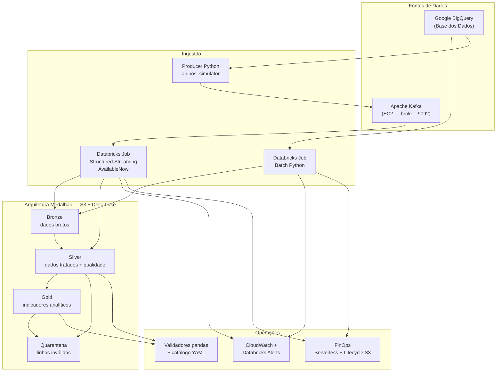
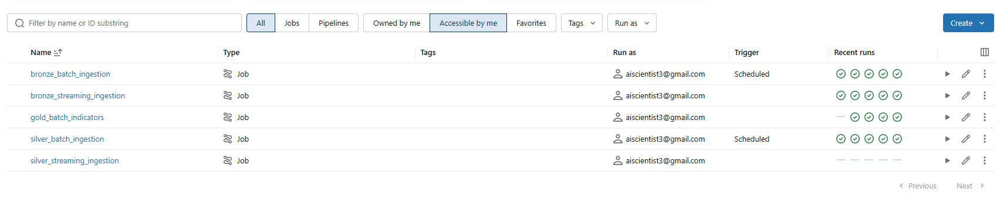

# Pipeline Híbrido — Análise da Alfabetização no Brasil

Tech Challenge Fase 2 — pipeline de dados **híbrida (Batch + Streaming)** com **Arquitetura Medalhão** (Bronze → Silver → Gold), integrando fontes da [Base dos Dados](https://basedosdados.org) para análise do **Compromisso Nacional Criança Alfabetizada**.

Documentação complementar:

| Documento | Conteúdo |
|---|---|
| [`docs/qualidade-dados.md`](docs/qualidade-dados.md) | Regras, quarentena e operação da qualidade |
| [`docs/finops-estimativa-custos.md`](docs/finops-estimativa-custos.md) | Estimativa teórica de custos |
| [`docs/README.md`](docs/README.md) | Catálogo / governança de dados |
| [`terraform/README.md`](terraform/README.md) | Provisionamento AWS + Databricks |

---

## Contexto do problema

A alfabetização na infância é pilar do desenvolvimento educacional e socioeconômico. O **Compromisso Nacional Criança Alfabetizada** articula União, estados, DF e municípios para que todas as crianças estejam alfabetizadas ao final do 2º ano do ensino fundamental.

A partir da Pesquisa Alfabetiza Brasil (INEP, 2023), foi definido o ponto de corte de **743 pontos** na escala Saeb — nível a partir do qual a criança é considerada alfabetizada. O **Indicador Criança Alfabetizada** expressa o percentual de estudantes que atingem esse patamar. A meta nacional é que, até **2030**, todas as crianças brasileiras estejam alfabetizadas nesse marco.

Compreender o fenômeno exige integrar:

- Metas nacionais, estaduais e municipais
- Dados territoriais (UF / município)
- Microdados educacionais (alunos)
- Indicadores de desempenho / gaps vs metas

Este projeto constrói uma pipeline em nuvem capaz de ingerir, tratar, validar e publicar essas bases de forma rastreável, escalável e com controle de custos.

---

## Objetivo técnico

Construir uma pipeline escalável em nuvem que realize:

1. Ingestão de fontes educacionais (Base dos Dados / BigQuery)
2. Tratamento, padronização e integração entre bases
3. Camada analítica confiável (Indicador Criança Alfabetizada + gaps)
4. Qualidade com quarentena e métricas
5. Monitoramento operacional
6. Práticas de FinOps documentadas e aplicadas na arquitetura

---

## Visão Geral da Arquitetura



### Fluxo de dados

| Etapa | Origem | Destino | Modo |
|---|---|---|---|
| Bronze batch | BigQuery (UF, município, metas) | `s3://…/bronze/…` | Job periódico |
| Streaming alunos | BigQuery → Producer → Kafka | Bronze MERGE → Silver MERGE | Micro-batch `AvailableNow` |
| Silver batch | Bronze Delta | `s3://…/silver/…` (+ quarentena) | Job após Bronze |
| Gold batch | Silver (`alunos` + metas) | `s3://…/gold/…` (+ quarentena) | Job após Silver |

Ordem recomendada: **Bronze batch → Silver batch → Gold batch**. Streaming de `alunos` pode rodar em paralelo após o broker Kafka estar disponível.


### Jobs no Databricks

Visão dos jobs no workspace (batch agendado + streaming sob demanda):



| Job | Papel |
|---|---|
| `bronze_batch_ingestion` | BigQuery → Bronze (UF, município, metas) — schedule diário |
| `silver_batch_ingestion` | Bronze → Silver (metas / território) — schedule diário |
| `bronze_streaming_ingestion` | Kafka → Bronze **e** Silver de `alunos` (mesmo run) |
| `gold_batch_indicators` | Silver → indicadores Gold |
| `silver_streaming_ingestion` | Opcional / Automática ao fim da ingestão streaming bronze |

---

## Stack Tecnológica

| Camada | Tecnologia | Status |
|---|---|---|
| Fonte de dados | Google BigQuery (Base dos Dados) | Implementado |
| Ingestão Batch | Databricks Jobs (Python `.py`) | Implementado |
| Ingestão Streaming | Apache Kafka (EC2) + Spark Structured Streaming (Databricks) | Implementado |
| Storage | AWS S3 + Delta Lake (Parquet/Snappy) | Implementado |
| Orquestração | Databricks Workflows (jobs por camada) | Implementado |
| Credenciais GCP | Databricks Secret Scope `gcp` | Implementado |
| Credenciais AWS / Kafka | Databricks Secret Scope `aws` (+ Instance Profile para clusters clássicos) | Implementado |
| Qualidade de dados | Validadores pandas + catálogo YAML + quarentena Delta | Implementado |
| Monitoramento | CloudWatch metrics/alarms/dashboard + SNS + e-mail Databricks | Implementado |
| IaC | Terraform (S3, IAM, jobs, monitoring) | Implementado |
| Broker Kafka gerenciado (MSK) | — | Não provisionado (lab em EC2) |

---

## Estrutura do Projeto

```
tech-challenge-2/
├── ingestion/
│   ├── batch/                      ← Bronze batch (BigQuery → S3)
│   │   ├── main.py
│   │   ├── bronze_writer.py
│   │   ├── metrics.py
│   │   ├── connections/            ← BigQuery, AWS, Spark S3
│   │   └── sources/                ← uf, municipio, meta_*
│   ├── silver/                     ← Bronze → Silver (+ qualidade)
│   │   ├── main.py
│   │   ├── transforms.py
│   │   ├── quality.py
│   │   ├── quarantine_writer.py
│   │   └── …
│   ├── gold/                       ← Silver → indicadores Gold
│   │   ├── main.py
│   │   ├── transforms.py
│   │   ├── quality.py
│   │   └── …
│   ├── streaming/                  ← Kafka → Bronze → Silver (alunos)
│   │   ├── producer/alunos_simulator.py
│   │   ├── kafka/main.py
│   │   ├── bronze_stream_writer.py
│   │   ├── silver_stream_writer.py
│   │   └── …
│   ├── common/                     ← dbutils, helpers de qualidade
│   └── delta_read.py               ← leitura Delta (incl. Serverless)
├── tests/
│   ├── batch/
│   ├── silver/
│   ├── gold/
│   └── streaming/
├── docs/
│   ├── qualidade-dados.md
│   ├── finops-estimativa-custos.md
│   └── catalog/                    ← contratos YAML das entidades
├── terraform/                      ← S3, IAM, jobs Databricks, monitoring
├── databricks/                     ← job_config.example.json
├── scripts/                        ← utilitários de micro-batch / testes
├── requirements.txt
└── README.md
```

---

## Fontes de Dados

### Batch (Bronze) — registry em `ingestion/batch/sources`

| Fonte | Tabela BigQuery | Destino S3 |
|---|---|---|
| UF | `basedosdados.br_bd_diretorios_brasil.uf` | `bronze/.../uf/` |
| Município | `basedosdados.br_bd_diretorios_brasil.municipio` | `bronze/.../municipio/` |
| Meta Brasil | `...meta_alfabetizacao_brasil` | `bronze/.../meta_brasil/ano=…/` |
| Meta UF | `...meta_alfabetizacao_uf` | `bronze/.../meta_uf/ano=…/` |
| Meta Município | `...meta_alfabetizacao_municipio` | `bronze/.../meta_municipio/ano=…/` |

### Streaming — microdados de alunos

| Fonte | Origem | Destino |
|---|---|---|
| Alunos | BigQuery `...alunos` → producer Kafka → consumer Databricks | `bronze/.../alunos/` e `silver/.../alunos/` (MERGE) |

> **Decisão:** `alunos` **não** entra no batch registry. A chegada contínua é simulada via Kafka; metas e diretórios permanecem batch (volume baixo, atualização esporádica).

### Metadados de auditoria (Bronze batch)

| Coluna | Descrição |
|---|---|
| `_ingestion_timestamp` | Data/hora UTC da ingestão (ISO 8601) |
| `_source_table` | Tabela de origem no BigQuery |
| `_batch_id` | UUID do lote de ingestão |

### Layout S3 (Medalhão)

```
s3://<bucket>/
├── bronze/br_inep_alfabetizacao/{uf,municipio,meta_*,alunos}/
├── silver/br_inep_alfabetizacao/{uf,municipio,meta_*,alunos}/
├── gold/br_inep_alfabetizacao/
│   ├── indicador_crianca_alfabetizada_municipio/
│   └── indicador_crianca_alfabetizada_uf/
└── quarantine/br_inep_alfabetizacao/{silver|gold}/{entity}/
```

---

## Camadas Medalhão

### Bronze — raw

- Dados brutos das fontes, sem transformações de negócio
- Batch: overwrite/append Delta + validação mínima de schema
- Streaming: MERGE por chave natural `(ano, id_aluno)`
- Histórico preservado; lifecycle S3: `bronze/` → **STANDARD_IA após 90 dias**

### Silver — tratados

- Padronização (`standardize_common`)
- Deduplicação por chave natural
- Enriquecimento territorial: `meta_uf ⋊ uf`, `meta_municipio ⋊ municipio`
- Gate de qualidade (completude, domínio, FK) → válidos na Silver / inválidos na quarentena
- **`alunos` (streaming):** projeção FinOps — Silver guarda só colunas de negócio/quality/Gold; linhagem Kafka (`_kafka_*`, `_event_*`) permanece **apenas na Bronze**

Entidades: `uf`, `municipio`, `meta_brasil`, `meta_uf`, `meta_municipio`, `alunos`.

### Gold — analítica

Datasets:

| Dataset | Conteúdo |
|---|---|
| `indicador_crianca_alfabetizada_municipio` | Taxa ponderada por município/rede + gaps |
| `indicador_crianca_alfabetizada_uf` | Taxa ponderada por UF/rede + gaps |

Inclui comparação com taxas INEP e **metas 2024–2030** (`gap_meta_YYYY`). Preparado para BI, análises e modelos (ver seção [Aplicação em IA](#aplicação-em-ia)).

---

## Qualidade de Dados

Engine própria (pandas + regras do catálogo YAML) — **sem** Great Expectations/dbt, para manter o stack enxuto e alinhado ao código existente.

| Camada | Comportamento |
|---|---|
| Bronze | Raw; schema mínimo no batch; DLQ lean (log) no streaming |
| Silver | Completude, domínio, referencial; quarentena Delta |
| Gold | Faixa 0–100, FK territorial; meta ausente = warning |

Detalhes operacionais: [`docs/qualidade-dados.md`](docs/qualidade-dados.md).

---

## Monitoramento

| Componente | O que cobre |
|---|---|
| CloudWatch custom metrics | Registros, duração, falhas, `quality_*` |
| Alarmes + SNS | Falha, duração, zero registros, S3 5xx |
| Dashboard CloudWatch | Visão consolidada do batch |
| Databricks job e-mail | Falha (e opcionalmente sucesso / duração) |

Setup: [`terraform/README.md`](terraform/README.md#monitoring).

---

## Decisões Arquiteturais (trade-offs)

| Decisão | Escolha | Alternativa | Motivo |
|---|---|---|---|
| Ingestão de `alunos` | Streaming (Kafka + micro-batch) | Batch único | Simula chegada contínua exigida pelo desafio; metas ficam batch |
| Lake | S3 + Delta Lake | Data warehouse (Redshift/BQ DW) | Custo baixo de storage, ACID no lake, flexibilidade medalhão |
| Compute | Databricks Serverless Jobs | Cluster clássico 24×7 | Sem idle DBU; timeout por job |
| Broker | Kafka em EC2 | Amazon MSK | Lab acadêmico: menor custo fixo; MSK fica como evolução |
| Qualidade | Validadores pandas + YAML | Great Expectations / dbt | Menos infra; regras versionadas no catálogo do repo |
| Rejeições Bronze stream | DLQ lean (log) | Persistir payload no S3 | Evita pagar storage por lixo; Silver/Gold usam quarentena Delta |

---

## Aplicação em IA

A camada Gold concentra features prontas para modelagem e análise avançada:

| Uso | Como a Gold ajuda |
|---|---|
| Predição de alfabetização | Taxa observada, gaps vs metas 2024–2030, rede, território |
| Desigualdade educacional | Comparar municípios/UFs e redes (municipal × estadual × privada) |
| Políticas públicas | Priorizar localidades com maior `gap_meta_*` / pior tendência |
| Clustering de vulnerabilidade | Combinar Gold com bases externas (IBGE, CadÚnico — opcional, fora do escopo atual) |

O ponto de corte Saeb (**743**) e o Indicador Criança Alfabetizada são o fio condutor semântico para features e labels em estudos futuros.

---

## Configuração de Credenciais

### 1. GCP — BigQuery (Secret Scope `gcp`)

```bash
databricks secrets create-scope gcp
databricks secrets put --scope gcp --key project-id \
    --string-value "YOUR_GCP_PROJECT_ID"
databricks secrets put --scope gcp --key service-account-json \
    --string-value "$(cat service-account.json)"
```

Fallback local:

```bash
export GOOGLE_APPLICATION_CREDENTIALS="/caminho/para/service-account.json"
# ou
export GCP_SERVICE_ACCOUNT_JSON='{"type":"service_account",...}'
export GCP_PROJECT_ID="YOUR_GCP_PROJECT_ID"
```

### 2. AWS — S3 (Secret Scope `aws`)

```bash
databricks secrets create-scope aws
databricks secrets put --scope aws --key s3-bucket --string-value "YOUR_BUCKET_NAME"
databricks secrets put --scope aws --key access-key-id --string-value "AKIA..."
databricks secrets put --scope aws --key secret-access-key --string-value "..."
```

Após `terraform apply`, use os outputs documentados em [`terraform/README.md`](terraform/README.md).

### 3. Kafka (mesmo scope `aws`)

```bash
databricks secrets put --scope aws --key kafka-bootstrap-servers \
    --string-value "<EC2_PUBLIC_IP>:9092"
databricks secrets put --scope aws --key kafka-topic \
    --string-value "br-inep-alfabetizacao.alunos.performance"
```

Fallback local: `KAFKA_BOOTSTRAP_SERVERS`, `KAFKA_TOPIC`, `S3_BUCKET`, `AWS_ACCESS_KEY_ID`, `AWS_SECRET_ACCESS_KEY`.

---

## Como Executar

### Instalação local

```bash
python -m venv .venv
# Windows: .\.venv\Scripts\Activate.ps1
source .venv/bin/activate
pip install -r requirements.txt
```

### Testes

```bash
pytest tests/ -v
```

### Bronze (batch)

```bash
python -m ingestion.batch.main --sources all --years 2023,2024
python -m ingestion.batch.main --sources uf,meta_brasil --years 2024
python -m ingestion.batch.main --sources meta_municipio --years 2024 --row-limit 10000
```

### Streaming — publicar eventos (producer)

```bash
export KAFKA_BOOTSTRAP_SERVERS="<EC2_IP>:9092"
export KAFKA_TOPIC="br-inep-alfabetizacao.alunos.performance"
python -m ingestion.streaming.producer.alunos_simulator --years 2024 --row-limit 100
```

### Streaming — consumir (Databricks / local Spark)

```bash
python -m ingestion.streaming.kafka.main --starting-offsets earliest
```

### Silver (batch)

```bash
python -m ingestion.silver.main --entities all --years 2023,2024
python -m ingestion.silver.main --entities uf,municipio --years 2023,2024
```

### Gold (batch)

```bash
python -m ingestion.gold.main --datasets all --years 2023,2024
```

Jobs equivalentes são provisionados pelo Terraform (`bronze`, `silver`, `gold`, streaming). Referência manual: [`databricks/job_config.example.json`](databricks/job_config.example.json).

---

## Boas Práticas Aplicadas

- Scripts Python versionáveis (sem notebooks em produção)
- Credenciais via Secret Scope / IAM (zero secrets no código)
- Contratos e qualidade no catálogo YAML + quarentena
- Retry exponencial e logging padronizado na ingestão batch
- Metadados de auditoria na Bronze
- Particionamento Delta por `ano`
- Testes unitários por camada (`tests/batch|silver|gold|streaming`)
- Parametrização via CLI e widgets Databricks
- Git com branches de feature e Pull Requests na `main`

---

## FinOps — Otimização de Custos da Arquitetura

Práticas de **FinOps** do pipeline híbrido (Batch + Streaming) com arquitetura
Medalhão (Bronze → Silver → Gold) em **AWS S3 + Delta Lake + Databricks**.

O objetivo é minimizar o custo total de propriedade (TCO) sem comprometer
rastreabilidade, qualidade e latência analítica exigidas pelo Compromisso
Nacional Criança Alfabetizada.

Estimativa monetária detalhada: [`docs/finops-estimativa-custos.md`](docs/finops-estimativa-custos.md).

### Princípios adotados

| Princípio | Como aplicamos |
|---|---|
| Pagar pelo uso | Databricks Jobs **Serverless** (sem cluster ocioso) |
| Armazenar barato, processar sob demanda | S3 + Delta (Parquet/Snappy) + lifecycle por camada |
| Ler só o necessário | Particionamento + predicate pushdown + projeção de colunas |
| Separar hot/cold | Bronze envelhece para STANDARD_IA; Silver/Gold ficam hot |
| Qualidade com custo controlado | Quarentena Delta append-only; DLQ Bronze em modo lean (log only) |
| Observabilidade de custo operacional | CloudWatch (duração, volume, falhas, quarantine/pass rate) + alertas SNS |

### 1. Uso eficiente de armazenamento

- **Formato colunar**: Delta Lake sobre **Parquet + compressão Snappy** — reduz volume em ~60–80% vs CSV/JSON e habilita leitura parcial de colunas.
- **Particionamento**:
  - Bronze: `ano` (alinhado ao ciclo do Censo/SAEB e às metas INEP).
  - Silver: `ano` (+ `sigla_uf` quando houver consulta regional frequente).
  - Gold: `ano` (e `sigla_uf` quando houver drill-down estadual).
  - Quarentena: `ano` quando a coluna existir (`quarantine/br_inep_alfabetizacao/{layer}/{entity}`).
- **Evitar over-partitioning**: não particionamos por `id_municipio`/`id_aluno` (alta cardinalidade → small files e custo de LIST no S3).
- **Ciclo de vida (S3 Lifecycle via Terraform)**:
  - Prefixo `bronze/` → **STANDARD_IA após 90 dias** (dados brutos raramente relidos após a promoção para Silver).
  - Abort de multipart uploads incompletos em 7 dias (evita lixo cobrado).
  - Silver/Gold permanecem em STANDARD (acesso analítico frequente).
  - Prefixo `quarantine/` ainda sem lifecycle dedicado — monitorar crescimento e, se necessário, aplicar IA/expiração (recomendação FinOps).
- **Idempotência com overwrite por partição**: reprocessamentos não duplicam histórico descontrolado; reduz crescimento silencioso do lake.
- **Quarentena vs DLQ (trade-off FinOps)**:
  - Silver/Gold: linhas inválidas vão para **Delta em S3** (append) — custo de storage baixo, mas cresce se a taxa de rejeição for alta.
  - Bronze streaming: eventos malformados ficam em **DLQ lean (somente log)** — não persistem payload no S3, evitando custo de armazenamento de lixo.

### 2. Otimização de queries (evitar full scans)

- **Filtro na origem (BigQuery)**: `WHERE ano IN (...)` antes do transfer — reduz *bytes billed* na GCP e o volume ingressado no S3.
- **Predicate pushdown / partition pruning**: leituras Silver/Gold devem aplicar filtros de `ano` (e `sigla_uf`) **antes** de materializar em memória, evitando carregar a tabela inteira.
- **Column pruning**: jobs Gold selecionam apenas colunas analíticas; Silver `alunos` projeta o subset quality/Gold (não materializa `caderno`, `id_escola`, linhagem Kafka, etc.).
- **Agregação na Gold**: indicadores municipais/UF são pré-calculados; o consumo analítico não precisa varrer `alunos` a cada dashboard.
- **Dev safeguards**: `--row-limit` / `DEV_ROW_LIMIT` para experimentos sem varrer a tabela completa de alunos.

### 3. Controle de recursos computacionais

#### Batch (metas, diretórios, indicadores)

- Jobs Databricks **Serverless** com timeout (ex.: 3600s) — custo proporcional à duração da execução.
- Schedule **desligado por padrão** em dev; em produção, cron pontual (ex.: Bronze 06:00 → Silver 07:00 → Gold 08:00), não cluster permanente.
- Sequência Silver → Gold com 1 h de folga evita rodar Gold sobre Silver incompleto (DBU desperdiçado).
- Parâmetros `--sources` / `--entities` / `--years` limitam o escopo de cada run.
- Concorrência controlada: um job por camada (Bronze → Silver → Gold), evitando contenção e reprocessamento paralelo da mesma partição.
- **Qualidade no caminho crítico**: validação (completude, domínio, referencial, faixa) roda em pandas dentro do mesmo job — overhead típico de poucos minutos de DBU; em troca, evita propagar lixo para Gold/BI.

#### Streaming (`alunos` via Kafka)

- **Não** mantemos cluster Spark 24×7.
- Usamos `Trigger.AvailableNow` (micro-batch sob demanda): o job sobe, consome o backlog, faz MERGE em Bronze/Silver e **encerra**.
- Schedule curto (ex.: a cada 5 min) só quando habilitado — padrão “quase tempo real” com custo de job efêmero.
- `maxOffsetsPerTrigger` limita o tamanho do micro-batch (controle de memória/DBU).
- Checkpoints evitam reprocessar offsets já commitados (custo + consistência).
- Eventos Kafka inválidos: **DLQ lean (log only)** — sem escrita S3 de payload rejeitado.
- Silver streaming: só faz MERGE das linhas válidas (com **column pruning**); inválidas vão para quarentena (mesmo prefixo batch).
- Envelope Kafka sem `ano` duplicado no topo — campos de negócio ficam só no `payload`.

#### Escolha batch vs streaming (custo)

| Carga | Modo | Justificativa FinOps |
|---|---|---|
| Metas Brasil/UF/Município, diretórios | Batch pontual | Volume pequeno, atualização anual/esporádica |
| Microdados `alunos` | Streaming em micro-batches | Simula chegada contínua sem pagar idle 24×7 |
| Indicadores Gold | Batch após Silver | Agregação barata sobre dados já tratados |
| Rejeições de qualidade | Quarentena S3 (Silver/Gold) / log (Bronze DLQ) | Isola lixo sem inflar camadas analíticas |

### 4. Decisões técnicas que reduzem custo operacional

1. **Delta Lake em vez de CSV/JSON** → menos GB-mês no S3 e menos I/O por query.
2. **Serverless em vez de cluster clássico sempre ligado** → elimina idle DBUs.
3. **Lifecycle Bronze → IA** → armazenamento frio mais barato para raw.
4. **Filtros na origem (BQ) + pushdown no lake** → menos compute e menos egress.
5. **Gold pré-agregada** → BI/consultas leem MB, não GB de microdados.
6. **Qualidade com quarentena** → Silver/Gold só recebem linhas válidas; reduz reprocessamento e dashboards “sujos”.
7. **DLQ Bronze lean (log only)** → não paga storage por eventos Kafka malformados.
8. **Monitoramento de duração/volume/qualidade (CloudWatch)** → detecta regressões de custo e picos de quarentena antes da fatura mensal.
9. **IaC (Terraform)** → ambientes reproduzíveis; evita recursos órfãos esquecidos.

### 5. O que monitorar (sinais de custo)

| Sinal | Ferramenta | Ação se degradar |
|---|---|---|
| `DurationSeconds` do job | CloudWatch + alarme | Revisar anos/escopo, small files, skew, regras de qualidade |
| `RecordsIngested` | CloudWatch | Validar filtros BQ / row-limit |
| `quality_quarantine_rows` / `quality_pass_rate` | CloudWatch | Investigar regra/fonte; alta quarentena = mais S3 append + DBU |
| Crescimento S3 por prefixo (`bronze/`, `silver/`, `gold/`, `quarantine/`) | S3 Inventory / Cost Explorer | Ajustar lifecycle / VACUUM / expiração da quarentena |
| Falhas repetidas | SNS + e-mail Databricks | Evitar retries caros em loop |

---

## Status da Entrega e Evoluções Futuras

### Implementado

- [x] Bronze batch (UF, município, metas)
- [x] Silver batch (padronização, dedup, joins, qualidade, quarentena)
- [x] Gold (indicadores município/UF + gap vs metas 2024–2030)
- [x] Streaming `alunos` (producer + Kafka EC2 + consumer Bronze→Silver)
- [x] Qualidade YAML + métricas CloudWatch
- [x] Monitoramento (alarms, SNS, Databricks e-mail)
- [x] Terraform (S3, IAM, jobs, monitoring) + FinOps documentado

### Evoluções opcionais / backlog

- [ ] Amazon MSK (substituir broker EC2)
- [ ] Alertas CloudWatch dedicados a `quality_pass_rate` / pico de quarentena
- [ ] Lifecycle/expiração do prefixo `quarantine/`
- [ ] Enriquecimento externo (IBGE, CadÚnico, Censo Escolar) — opcional no PDF
- [ ] Dashboard BI sobre a Gold
- [ ] Workflow Databricks multi-task (Bronze → Silver → Gold encadeado)
- [ ] Vídeo executivo (até 5 min) — entrega do PDF, fora do repositório

---

## Referências

- [Base dos Dados — Avaliação da Alfabetização](https://basedosdados.org/dataset/073a39d4-89cf-4068-b1e8-34ed0d9c0b72)
- [Compromisso Nacional Criança Alfabetizada — Inep](https://www.gov.br/inep/pt-br/areas-de-atuacao/pesquisas-e-avaliacao/avaliacao-da-alfabetizacao)
- [Documentação BigQuery — Base dos Dados](https://basedosdados.org/docs/access_data_bq)
- [Delta Lake Documentation](https://docs.delta.io)
- [Databricks Secrets Guide](https://docs.databricks.com/en/security/secrets/index.html)
- [Estimativa de Custo Teórica (FinOps)](docs/finops-estimativa-custos.md)
- [Qualidade de Dados](docs/qualidade-dados.md)
