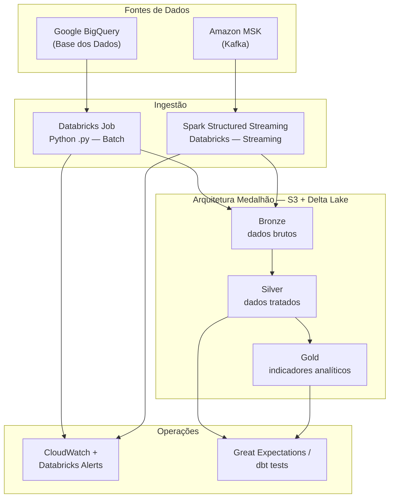

# Pipeline Híbrido — Análise da Alfabetização no Brasil

Tech Challenge Fase 2 — Pipeline de dados híbrida (Batch + Streaming) com Arquitetura Medalhão, integrando fontes educacionais da [Base dos Dados](https://basedosdados.org) para análise do programa Compromisso Nacional Criança Alfabetizada.

---

## Visão Geral da Arquitetura



---

## Stack Tecnológica

| Camada | Tecnologia |
|---|---|
| Fonte de dados | Google BigQuery (Base dos Dados) |
| Ingestão Batch | Databricks Jobs (Python `.py`) |
| Ingestão Streaming | Amazon MSK (Kafka) + Spark Structured Streaming |
| Storage | AWS S3 + Delta Lake |
| Orquestração | Databricks Workflows |
| Credenciais GCP | Databricks Secret Scope |
| Credenciais AWS | IAM Instance Profile |
| Qualidade de dados | Great Expectations / dbt tests *(pendente)* |
| Monitoramento | CloudWatch + Databricks Alerts *(pendente)* |
| IaC | Terraform *(pendente)* |

---

## Estrutura do Projeto

```
tech-challenge-2/
├── ingestion/
│   └── batch/                      ← Ingestão batch (implementado)
│       ├── config.py               ← Parâmetros centralizados
│       ├── connections/
│       │   ├── bigquery_client.py  ← Cliente GCP via Databricks Secrets
│       │   └── spark_s3.py         ← SparkSession com IAM Instance Profile
│       ├── sources/
│       │   ├── base_source.py      ← Classe abstrata + retry
│       │   ├── uf.py
│       │   ├── municipio.py
│       │   ├── meta_brasil.py
│       │   ├── meta_uf.py
│       │   ├── meta_municipio.py
│       │   └── alunos.py
│       ├── bronze_writer.py        ← Gravação Delta Lake no S3
│       └── main.py                 ← Entry point do Databricks Job
├── tests/
│   └── batch/
│       ├── conftest.py
│       └── test_sources.py
├── requirements.txt
└── README.md
```

---

## Camada Bronze — Ingestão Batch (Implementado)

### Fontes integradas

| Fonte | Tabela BigQuery | Destino S3 |
|---|---|---|
| UF | `basedosdados.br_bd_diretorios_brasil.uf` | `bronze/.../uf/` |
| Município | `basedosdados.br_bd_diretorios_brasil.municipio` | `bronze/.../municipio/` |
| Meta Brasil | `basedosdados.br_inep_avaliacao_alfabetizacao.brasil` | `bronze/.../meta_brasil/ano=XXXX/` |
| Meta UF | `basedosdados.br_inep_avaliacao_alfabetizacao.uf` | `bronze/.../meta_uf/ano=XXXX/` |
| Meta Município | `basedosdados.br_inep_avaliacao_alfabetizacao.municipio` | `bronze/.../meta_municipio/ano=XXXX/` |
| Alunos (microdados) | `basedosdados.br_inep_avaliacao_alfabetizacao.microdados` | `bronze/.../alunos/ano=XXXX/` |

### Metadados adicionados em cada registro

| Coluna | Descrição |
|---|---|
| `_ingestion_timestamp` | Data/hora UTC da ingestão (ISO 8601) |
| `_source_table` | Tabela de origem no BigQuery |
| `_batch_id` | UUID único do lote de ingestão |

### Layout S3 (Bronze)

```
s3://tech-challenge-2-datalake/
└── bronze/
    └── br_inep_alfabetizacao/
        ├── uf/
        ├── municipio/
        ├── meta_brasil/
        │   ├── ano=2023/
        │   └── ano=2024/
        ├── meta_uf/
        │   ├── ano=2023/
        │   └── ano=2024/
        ├── meta_municipio/
        │   ├── ano=2023/
        │   └── ano=2024/
        └── alunos/
            ├── ano=2023/
            └── ano=2024/
```

---

## Configuração de Credenciais

### 1. GCP — BigQuery (Databricks Secret Scope)

```bash
# Criar Secret Scope "gcp" via Databricks CLI
databricks secrets create-scope gcp
databricks secrets put-secret gcp service-account-json \
    --string-value "$(cat service-account.json)"
```

Variáveis de ambiente relevantes:

| Variável | Padrão | Descrição |
|---|---|---|
| `GCP_PROJECT_ID` | `fase-2-tech-challenge` | Projeto GCP para billing |
| `DATABRICKS_SECRET_SCOPE` | `gcp` | Nome do Secret Scope |
| `DATABRICKS_SECRET_KEY` | `service-account-json` | Chave do JSON da service account |

**Fallback para desenvolvimento local:**
```bash
# Opção 1 — arquivo
export GOOGLE_APPLICATION_CREDENTIALS="/caminho/para/service-account.json"

# Opção 2 — JSON inline
export GCP_SERVICE_ACCOUNT_JSON='{"type":"service_account",...}'
```

### 2. AWS — S3 (IAM Instance Profile)

Associe ao cluster Databricks um **Instance Profile** com a seguinte política:

```json
{
  "Effect": "Allow",
  "Action": ["s3:PutObject", "s3:GetObject", "s3:ListBucket", "s3:DeleteObject"],
  "Resource": [
    "arn:aws:s3:::tech-challenge-2-datalake",
    "arn:aws:s3:::tech-challenge-2-datalake/*"
  ]
}
```

Variáveis de ambiente relevantes:

| Variável | Padrão | Descrição |
|---|---|---|
| `S3_BUCKET` | `tech-challenge-2-datalake` | Bucket de destino |
| `BRONZE_PREFIX` | `bronze/br_inep_alfabetizacao` | Prefixo da camada Bronze |
| `AWS_DEFAULT_REGION` | `us-east-1` | Região AWS |
| `S3_ENDPOINT` | *(vazio)* | Endpoint alternativo (MinIO / LocalStack) |

---

## Como Executar

### Instalação local (desenvolvimento)

```bash
python -m venv .venv
source .venv/bin/activate
pip install -r requirements.txt
```

### Testes unitários

```bash
pytest tests/batch/ -v
```

### Databricks Job (produção)

**Task type:** Python script
**Caminho:** `ingestion/batch/main.py`

```bash
# Ingerir todas as fontes, anos 2023 e 2024
python -m ingestion.batch.main --sources all --years 2023,2024

# Fontes específicas
python -m ingestion.batch.main --sources uf,meta_brasil --years 2024

# Modo desenvolvimento — limitar linhas por fonte
python -m ingestion.batch.main --sources meta_municipio --years 2024 --row-limit 10000

# Modo append (preserva dados existentes)
python -m ingestion.batch.main --sources alunos --years 2024 --append
```

### Databricks Widgets (alternativa via UI)

| Widget | Exemplo | Descrição |
|---|---|---|
| `sources` | `all` | Fontes separadas por vírgula ou `all` |
| `years` | `2023,2024` | Anos a ingerir |
| `batch_id` | *(vazio)* | UUID gerado automaticamente se vazio |
| `row_limit` | `10000` | Limite de linhas (vazio = sem limite) |
| `overwrite` | `true` | `false` para modo append |

---

## Boas Práticas Aplicadas (Batch Bronze)

- Scripts Python versionáveis (sem notebooks em produção)
- Credenciais via Databricks Secret Scope e IAM (zero secrets hardcoded)
- Classe base com contrato, retry exponencial e logging padronizado
- Configuração centralizada desacoplada de código
- Metadados de auditoria (`_ingestion_timestamp`, `_source_table`, `_batch_id`)
- Particionamento Delta Lake por `ano` para leituras seletivas nas camadas Silver/Gold
- Validação de schema mínimo antes da gravação
- Testes unitários com mocks — sem dependência de serviços de nuvem
- Parametrização via CLI e Databricks Widgets

---

## FinOps

- Filtrar por `ano` no BigQuery antes de transferir dados
- Usar `--row-limit` durante desenvolvimento para reduzir custo por query
- Particionar Delta por `ano` no S3 para varreduras seletivas
- Configurar lifecycle policy no S3 para dados Bronze antigos *(pendente)*
- Reservar slots BigQuery para workloads recorrentes *(a avaliar)*

---

## TODO — Próximas Entregas

### Silver — Transformações e Joins
- [ ] Padronizar schemas entre fontes (tipos, nomes de colunas)
- [ ] Deduplicar registros por chave natural
- [ ] Join `meta_municipio` + `municipio` (enriquecer com dados territoriais)
- [ ] Join `meta_uf` + `uf`
- [ ] Gravar camada Silver em `s3://.../silver/`

### Gold — Indicadores Analíticos
- [ ] Calcular Indicador Criança Alfabetizada por UF e município
- [ ] Comparar resultados vs. metas (gap analysis)
- [ ] Séries temporais de evolução (2023–2030)
- [ ] Tabelas prontas para BI/dashboard

### Streaming — Kafka + Spark Structured Streaming
- [ ] Provisionar Amazon MSK
- [ ] Producer Python simulando chegada de microdados de alunos
- [ ] Consumer Spark Structured Streaming no Databricks
- [ ] Persistência de eventos na camada Bronze/Silver

### Qualidade de Dados
- [ ] Great Expectations ou dbt tests na Silver
- [ ] Validação de completude, unicidade e domínios
- [ ] Alertas automáticos em falhas de qualidade

### Monitoramento
- [ ] Métricas de execução por job (registros, duração, falhas)
- [ ] CloudWatch Alarms
- [ ] Databricks job alerts (e-mail/Slack)

### IaC — Terraform
- [ ] Bucket S3 + lifecycle policies
- [ ] IAM roles e Instance Profile
- [ ] Amazon MSK cluster
- [ ] Definições de Databricks Workflows

---

## Referências

- [Base dos Dados — Avaliação da Alfabetização](https://basedosdados.org/dataset/073a39d4-89cf-4068-b1e8-34ed0d9c0b72)
- [Compromisso Nacional Criança Alfabetizada — Inep](https://www.gov.br/inep/pt-br/areas-de-atuacao/pesquisas-e-avaliacao/avaliacao-da-alfabetizacao)
- [Documentação BigQuery — Base dos Dados](https://basedosdados.org/docs/access_data_bq)
- [Delta Lake Documentation](https://docs.delta.io)
- [Databricks Secrets Guide](https://docs.databricks.com/en/security/secrets/index.html)
