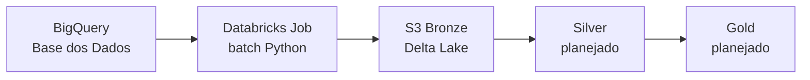

# Catálogo de Dados — Tech Challenge Fase 2

Catálogo das entidades ingeridas na **camada Bronze** do pipeline de alfabetização no Brasil. Documentação em português, alinhada a práticas de mercado de governança e produto de dados (ownership, lineage, contrato de dados, qualidade).

Metadados estruturados ficam em [`docs/catalogo/`](catalogo/).

Estimativa de custos (FinOps): [`finops-estimativa-custos.md`](finops-estimativa-custos.md).

---

## Governança

| Campo | Valor |
|---|---|
| **Domínio de negócio** | Metas INEP |
| **Data Owner** | AI Scientist — aiscientist3@gmail.com |
| **Data Stewards** | Samuel Porto, Walter Ferreira, Amanda Rarymi |
| **Classificação** | Pública |
| **Dado pessoal** | Não (IDs mascarados/fictícios na fonte INEP) |
| **Contexto** | Trabalho de pós-graduação — sem domínios corporativos formais |

Detalhes: [`catalogo/governanca.yaml`](catalogo/governanca.yaml)

---

## Stack e lineage (visão geral)

### Casos de uso analíticos

- Quais municípios estão abaixo da meta de alfabetização 2024 por rede de ensino?
- Como a taxa de alfabetização evolui por UF, município e rede ao longo dos anos disponíveis?
- Quais redes de ensino concentram maior proporção de alunos nos níveis mais baixos da escala SAEB?
- Qual a diferença entre a proficiência média em LP e a meta de alfabetização por território?
- Quais territórios apresentam baixa participação na avaliação e exigem cautela na leitura dos indicadores?

---

## Entidades — camada Bronze

| ID | Nome | Tipo | Partição | Origem BigQuery | Status catálogo |
|---|---|---|---|---|---|
| `alunos` | Microdados de Alunos | Fato | `ano` | `...alfabetizacao.alunos` | Completo |
| `meta_brasil` | Meta Alfabetização — Brasil | Indicador | `ano` | `...meta_alfabetizacao_brasil` | Completo |
| `meta_uf` | Meta Alfabetização — UF | Indicador | `ano` | `...meta_alfabetizacao_uf` | Completo |
| `meta_municipio` | Meta Alfabetização — Município | Indicador | `ano` | `...meta_alfabetizacao_municipio` | Completo |
| `uf` | Unidades Federativas | Referência | — | `br_bd_diretorios_brasil.uf` | Completo |
| `municipio` | Municípios | Referência | — | `br_bd_diretorios_brasil.municipio` | Completo |
| `municipio_indicadores` | Município — Indicadores da Avaliação | Indicador | `ano` | `...alfabetizacao.municipio` | Completo (não ingerido) |
| `uf_indicadores` | UF — Indicadores da Avaliação | Indicador | `ano` | `...alfabetizacao.uf` | Completo (não ingerido) |

Índice YAML: [`catalogo/entities/_index.yaml`](catalogo/entities/_index.yaml)

---

## Metadados técnicos de ingestão

Colunas adicionadas pelo pipeline em **todas** as entidades Bronze:

| Coluna | Tipo | Descrição |
|---|---|---|
| `_ingestion_timestamp` | STRING | Data/hora UTC da ingestão (ISO 8601) |
| `_source_table` | STRING | Tabela de origem no BigQuery |
| `_batch_id` | STRING | UUID único do lote de ingestão |

Implementação: [`ingestion/batch/bronze_writer.py`](../ingestion/batch/bronze_writer.py)

---

## Entidade: `alunos`

**Arquivo YAML:** [`catalogo/entities/alunos.yaml`](catalogo/entities/alunos.yaml)

### Resumo

Microdados em nível de aluno da Avaliação da Alfabetização. Inclui o indicador **alfabetizado**, **proficiência** (escala SAEB) e **peso amostral**. Granularidade: **1 linha por aluno por ano**.

### Origem e destino

| | |
|---|---|
| **Fonte** | `basedosdados.br_inep_avaliacao_alfabetizacao.alunos` |
| **Destino** | `s3://{bucket}/bronze/br_inep_alfabetizacao/alunos/ano={ano}/` |
| **Formato** | Delta Lake |
| **Período histórico** | 2023–2024 |
| **Volume estimado** | Milhões de linhas por ano [a confirmar] |
| **Crescimento anual** | Proporcional ao número de alunos avaliados por ano [a confirmar] |

### Schema de negócio

| Coluna | Tipo | Descrição | Chave |
|---|---|---|---|
| `ano` | INTEGER | Ano de aplicação da avaliação estadual | PK |
| `id_municipio` | STRING | ID Município de 7 dígitos | FK → `municipio` |
| `id_escola` | STRING | Máscara do código da escola (fictício) | |
| `id_aluno` | STRING | Código do aluno | PK |
| `caderno` | STRING | Caderno da prova de LP Valores possíveis: [a confirmar] | |
| `serie` | STRING | Ano escolar Valores possíveis: `2º ano`, `3º ano` | |
| `rede` | STRING | Dependência administrativa da escola Valores possíveis: `municipal`, `estadual`, `federal`, `privada` | |
| `presenca` | STRING | Presença na prova de LP Valores possíveis: [a confirmar] | |
| `preenchimento_caderno` | STRING | Preenchimento da prova de LP Valores possíveis: [a confirmar] | |
| `alfabetizado` | STRING | Considerado alfabetizado na avaliação Valores possíveis: `Sim`, `Não` (ou `0`, `1`, conforme codificação da fonte) | Indicador |
| `proficiencia` | FLOAT | Proficiência em LP (escala SAEB) | Indicador |
| `peso_aluno` | FLOAT | Peso amostral do aluno | |

### Regras de qualidade (documentadas)

- `ano` obrigatório
- Unicidade `(ano, id_aluno)` por carga
- `id_municipio` com 7 dígitos
- Nulos esperados: `proficiencia`, `peso_aluno`, `presenca`, `preenchimento_caderno`, `caderno` e `alfabetizado` podem ser nulos quando o aluno não realizou a prova, não teve caderno válido ou a informação não foi disponibilizada na origem; identificadores mascarados podem ser nulos conforme qualidade da fonte [a confirmar].

### Atualização e SLA

| Campo | Valor |
|---|---|
| **Frequência** | Anual — dados INEP |
| **Disponibilidade esperada** | Até 30 dias após encerramento da avaliação [a confirmar] |
| **Janela de carga** | Batch único por ano |

### Relacionamentos

- `alunos.id_municipio` → `municipio.id_municipio` (planejado na Silver)

---

## Entidade: `meta_brasil`

**Arquivo YAML:** [`catalogo/entities/meta_brasil.yaml`](catalogo/entities/meta_brasil.yaml)

### Resumo

Indicadores e metas de alfabetização **em nível nacional**, segmentados por **rede de ensino**. Inclui taxa observada, metas 2024–2030 e percentual de participação no país.

### Origem e destino

| | |
|---|---|
| **Fonte** | `basedosdados.br_inep_avaliacao_alfabetizacao.meta_alfabetizacao_brasil` |
| **Destino** | `s3://{bucket}/bronze/br_inep_alfabetizacao/meta_brasil/ano={ano}/` |
| **Formato** | Delta Lake |
| **Período histórico** | 2023–2024 |
| **Volume estimado** | Dezenas de linhas por ano [a confirmar] |
| **Crescimento anual** | Baixo; crescimento proporcional ao número de redes publicadas [a confirmar] |

### Schema de negócio

| Coluna | Tipo | Descrição | Chave |
|---|---|---|---|
| `ano` | INTEGER | Ano da avaliação | PK |
| `rede` | STRING | Rede de ensino Valores possíveis: `municipal`, `estadual`, `federal`, `privada` | PK |
| `taxa_alfabetizacao` | FLOAT | % alfabetizados no Brasil | Indicador |
| `meta_alfabetizacao_2024` | FLOAT | Meta de alfabetização em 2024 | Indicador |
| `meta_alfabetizacao_2025` | FLOAT | Meta de alfabetização em 2025 | Indicador |
| `meta_alfabetizacao_2026` | FLOAT | Meta de alfabetização em 2026 | Indicador |
| `meta_alfabetizacao_2027` | FLOAT | Meta de alfabetização em 2027 | Indicador |
| `meta_alfabetizacao_2028` | FLOAT | Meta de alfabetização em 2028 | Indicador |
| `meta_alfabetizacao_2029` | FLOAT | Meta de alfabetização em 2029 | Indicador |
| `meta_alfabetizacao_2030` | FLOAT | Meta de alfabetização em 2030 | Indicador |
| `percentual_participacao` | FLOAT | % de participação no país | Indicador |

### Regras de qualidade (documentadas)

- `ano` obrigatório
- Unicidade `(ano, rede)` por carga
- Taxas, metas e percentual de participação entre 0 e 100
- Nulos esperados: metas futuras, `taxa_alfabetizacao` e `percentual_participacao` podem ser nulos quando a origem ainda não publicou o indicador para o ano/rede ou quando o recorte não se aplica [a confirmar].

### Atualização e SLA

| Campo | Valor |
|---|---|
| **Frequência** | Anual — dados INEP |
| **Disponibilidade esperada** | Até 30 dias após encerramento da avaliação [a confirmar] |
| **Janela de carga** | Batch único por ano |

---

## Entidade: `meta_uf`

**Arquivo YAML:** [`catalogo/entities/meta_uf.yaml`](catalogo/entities/meta_uf.yaml)

### Resumo

Indicadores e metas de alfabetização **por UF**, segmentados por **rede de ensino**. Inclui taxa observada, metas 2024–2030 e percentual de participação no estado.

### Origem e destino

| | |
|---|---|
| **Fonte** | `basedosdados.br_inep_avaliacao_alfabetizacao.meta_alfabetizacao_uf` |
| **Destino** | `s3://{bucket}/bronze/br_inep_alfabetizacao/meta_uf/ano={ano}/` |
| **Formato** | Delta Lake |
| **Período histórico** | 2023–2024 |
| **Volume estimado** | Centenas de linhas por ano [a confirmar] |
| **Crescimento anual** | Baixo; crescimento proporcional ao número de UFs e redes publicadas [a confirmar] |

### Schema de negócio

| Coluna | Tipo | Descrição | Chave |
|---|---|---|---|
| `ano` | INTEGER | Ano da avaliação | PK |
| `sigla_uf` | STRING | Sigla da unidade da federação | PK / FK → `uf` |
| `rede` | STRING | Rede de ensino Valores possíveis: `municipal`, `estadual`, `federal`, `privada` | PK |
| `taxa_alfabetizacao` | FLOAT | % alfabetizados no estado | Indicador |
| `meta_alfabetizacao_2024` | FLOAT | Meta de alfabetização em 2024 | Indicador |
| `meta_alfabetizacao_2025` | FLOAT | Meta de alfabetização em 2025 | Indicador |
| `meta_alfabetizacao_2026` | FLOAT | Meta de alfabetização em 2026 | Indicador |
| `meta_alfabetizacao_2027` | FLOAT | Meta de alfabetização em 2027 | Indicador |
| `meta_alfabetizacao_2028` | FLOAT | Meta de alfabetização em 2028 | Indicador |
| `meta_alfabetizacao_2029` | FLOAT | Meta de alfabetização em 2029 | Indicador |
| `meta_alfabetizacao_2030` | FLOAT | Meta de alfabetização em 2030 | Indicador |
| `percentual_participacao` | FLOAT | % de participação no estado | Indicador |

### Regras de qualidade (documentadas)

- `ano` obrigatório
- Unicidade `(ano, sigla_uf, rede)` por carga
- Taxas, metas e percentual de participação entre 0 e 100
- Nulos esperados: metas futuras, `taxa_alfabetizacao` e `percentual_participacao` podem ser nulos quando a origem ainda não publicou o indicador para o ano/UF/rede ou quando o recorte não se aplica [a confirmar].

### Atualização e SLA

| Campo | Valor |
|---|---|
| **Frequência** | Anual — dados INEP |
| **Disponibilidade esperada** | Até 30 dias após encerramento da avaliação [a confirmar] |
| **Janela de carga** | Batch único por ano |

### Relacionamentos

- `meta_uf.sigla_uf` → `uf.sigla` (planejado na Silver)

---

## Entidade: `meta_municipio`

**Arquivo YAML:** [`catalogo/entities/meta_municipio.yaml`](catalogo/entities/meta_municipio.yaml)

### Resumo

Indicadores e metas de alfabetização **por município**, segmentados por **rede de ensino**. Inclui taxa observada, metas 2024–2030, nível de alfabetização e percentual de participação municipal.

### Origem e destino

| | |
|---|---|
| **Fonte** | `basedosdados.br_inep_avaliacao_alfabetizacao.meta_alfabetizacao_municipio` |
| **Destino** | `s3://{bucket}/bronze/br_inep_alfabetizacao/meta_municipio/ano={ano}/` |
| **Formato** | Delta Lake |
| **Período histórico** | 2023–2024 |
| **Volume estimado** | Dezenas de milhares de linhas por ano [a confirmar] |
| **Crescimento anual** | Proporcional ao número de municípios, redes e anos publicados [a confirmar] |

### Schema de negócio

| Coluna | Tipo | Descrição | Chave |
|---|---|---|---|
| `ano` | INTEGER | Ano da avaliação | PK |
| `id_municipio` | STRING | ID município de 7 dígitos | PK / FK → `municipio` |
| `rede` | STRING | Rede de ensino Valores possíveis: `municipal`, `estadual`, `federal`, `privada` | PK |
| `taxa_alfabetizacao` | FLOAT | Taxa de alfabetização | Indicador |
| `meta_alfabetizacao_2024` | FLOAT | Meta de alfabetização em 2024 | Indicador |
| `meta_alfabetizacao_2025` | FLOAT | Meta de alfabetização em 2025 | Indicador |
| `meta_alfabetizacao_2026` | FLOAT | Meta de alfabetização em 2026 | Indicador |
| `meta_alfabetizacao_2027` | FLOAT | Meta de alfabetização em 2027 | Indicador |
| `meta_alfabetizacao_2028` | FLOAT | Meta de alfabetização em 2028 | Indicador |
| `meta_alfabetizacao_2029` | FLOAT | Meta de alfabetização em 2029 | Indicador |
| `meta_alfabetizacao_2030` | FLOAT | Meta de alfabetização em 2030 | Indicador |
| `nivel_alfabetizacao` | INTEGER | Nível de alfabetização Valores possíveis: `0`–`8` | Indicador |
| `percentual_participacao` | FLOAT | % de participação no município | Indicador |

### Regras de qualidade (documentadas)

- `ano` obrigatório
- Unicidade `(ano, id_municipio, rede)` por carga
- `id_municipio` com 7 dígitos
- Taxas, metas e percentual de participação entre 0 e 100
- Nulos esperados: metas futuras, `taxa_alfabetizacao`, `nivel_alfabetizacao` e `percentual_participacao` podem ser nulos quando a origem ainda não publicou o indicador para o ano/município/rede, quando o recorte não se aplica ou quando há baixa cobertura amostral [a confirmar].

### Atualização e SLA

| Campo | Valor |
|---|---|
| **Frequência** | Anual — dados INEP |
| **Disponibilidade esperada** | Até 30 dias após encerramento da avaliação [a confirmar] |
| **Janela de carga** | Batch único por ano |

### Relacionamentos

- `meta_municipio.id_municipio` → `municipio.id_municipio` (planejado na Silver)

---

## Entidade: `municipio`

**Arquivo YAML:** [`catalogo/entities/municipio.yaml`](catalogo/entities/municipio.yaml)

### Resumo

Diretório de referência dos **municípios brasileiros** (IBGE): identificadores, hierarquia geográfica, vínculo com UF e centróide. Ingerido no pipeline para enriquecimento territorial na Silver.

### Importante — duas tabelas `municipio`

| Tabela | Uso no projeto |
|---|---|
| `br_bd_diretorios_brasil.municipio` | Referência territorial — **ingerida** em `bronze/.../municipio/` (este schema) |
| `br_inep_avaliacao_alfabetizacao.municipio` | Indicadores da avaliação — ver [`municipio_indicadores`](catalogo/entities/municipio_indicadores.yaml) |

### Origem e destino

| | |
|---|---|
| **Fonte** | `basedosdados.br_bd_diretorios_brasil.municipio` |
| **Destino** | `s3://{bucket}/bronze/br_inep_alfabetizacao/municipio/` |
| **Formato** | Delta Lake (sem partição por ano) |
| **Período histórico** | [a confirmar] |
| **Volume estimado** | Cerca de 5,6 mil linhas [a confirmar] |
| **Crescimento anual** | Baixo; alterações cadastrais pontuais em municípios e atributos territoriais [a confirmar] |

### Schema de negócio

| Coluna | Tipo | Descrição | Chave |
|---|---|---|---|
| `id_municipio` | STRING | ID Município — IBGE 7 dígitos | PK |
| `id_municipio_6` | STRING | ID Município — IBGE 6 dígitos | |
| `id_municipio_tse` | STRING | ID Município — TSE | |
| `id_municipio_rf` | STRING | ID Município — Receita Federal | |
| `id_municipio_bcb` | STRING | ID Município — Banco Central | |
| `nome` | STRING | Nome do município | |
| `capital_uf` | INTEGER | Indica se é capital da UF | |
| `id_comarca` | STRING | ID sede comarca | |
| `id_regiao_saude` | STRING | ID região de saúde | |
| `nome_regiao_saude` | STRING | Nome da região de saúde | |
| `id_regiao_imediata` | STRING | ID região imediata — IBGE | |
| `nome_regiao_imediata` | STRING | Nome da região imediata | |
| `id_regiao_intermediaria` | STRING | ID região intermediária — IBGE | |
| `nome_regiao_intermediaria` | STRING | Nome da região intermediária | |
| `id_microrregiao` | STRING | ID microrregião — IBGE | |
| `nome_microrregiao` | STRING | Nome da microrregião | |
| `id_mesorregiao` | STRING | ID mesorregião — IBGE | |
| `nome_mesorregiao` | STRING | Nome da mesorregião | |
| `id_regiao_metropolitana` | STRING | ID região metropolitana — IBGE | |
| `nome_regiao_metropolitana` | STRING | Nome da região metropolitana | |
| `ddd` | STRING | Código DDD | |
| `id_uf` | STRING | ID da UF — IBGE | FK → `uf` |
| `sigla_uf` | STRING | Sigla da UF | FK → `uf` |
| `nome_uf` | STRING | Nome da UF | |
| `nome_regiao` | STRING | Grande região brasileira | |
| `amazonia_legal` | INTEGER | Indicador Amazônia Legal | |
| `centroide` | GEOGRAPHY | Centróide do município | |

### Regras de qualidade (documentadas)

- `id_municipio` e `nome` obrigatórios
- Unicidade de `id_municipio` por carga
- `id_municipio` com 7 dígitos
- Nulos esperados: campos auxiliares de hierarquia territorial, códigos externos e `centroide` podem ser nulos quando não aplicáveis ou não informados na fonte; `id_regiao_metropolitana` pode ser nulo para municípios fora de região metropolitana [a confirmar].

### Atualização e SLA

| Campo | Valor |
|---|---|
| **Frequência** | Anual ou conforme atualização da Base dos Dados [a confirmar] |
| **Disponibilidade esperada** | Até 30 dias após atualização da fonte [a confirmar] |
| **Janela de carga** | Batch de referência territorial |

### Relacionamentos (downstream)

- `alunos.id_municipio` → `municipio.id_municipio`
- `meta_municipio.id_municipio` → `municipio.id_municipio`
- `municipio_indicadores.id_municipio` → `municipio.id_municipio`
- `municipio.sigla_uf` → `uf.sigla`

---

## Entidade: `municipio_indicadores`

**Arquivo YAML:** [`catalogo/entities/municipio_indicadores.yaml`](catalogo/entities/municipio_indicadores.yaml)

### Resumo

Indicadores agregados da avaliação **por município**, com série, rede, taxa de alfabetização, média de LP (SAEB) e proporção de alunos nos níveis 0–8.

### Importante — duas tabelas `municipio`

| Tabela | Uso no projeto |
|---|---|
| `br_bd_diretorios_brasil.municipio` | Referência territorial — **ingerida** em `bronze/.../municipio/` — ver [`municipio`](catalogo/entities/municipio.yaml) |
| `br_inep_avaliacao_alfabetizacao.municipio` | Indicadores da avaliação — **catálogo only** (este schema) |

### Origem e destino

| | |
|---|---|
| **Fonte** | `basedosdados.br_inep_avaliacao_alfabetizacao.municipio` |
| **Destino** | `s3://{bucket}/bronze/br_inep_alfabetizacao/municipio_indicadores/` (sugerido; não ingerido) |
| **Formato** | Delta Lake (planejado) |
| **Período histórico** | 2023–2024 |
| **Volume estimado** | Dezenas de milhares de linhas por ano [a confirmar] |
| **Crescimento anual** | Proporcional ao número de municípios, séries, redes e anos publicados [a confirmar] |

### Chave de negócio

`(ano, id_municipio, serie, rede)`

### Schema de negócio

| Coluna | Tipo | Descrição | Chave |
|---|---|---|---|
| `ano` | INTEGER | Ano de aplicação da avaliação estadual | PK |
| `id_municipio` | STRING | ID Município | PK / FK → `municipio` |
| `serie` | STRING | Ano escolar Valores possíveis: `2º ano`, `3º ano` | PK |
| `rede` | STRING | Rede de ensino Valores possíveis: `municipal`, `estadual`, `federal`, `privada` | PK |
| `taxa_alfabetizacao` | FLOAT | Percentual dos alunos avaliados no município considerados alfabetizados na avaliação estadual | Indicador |
| `media_portugues` | FLOAT | Média ponderada do município na avaliação estadual em Língua Portuguesa (LP), equalizada com o SAEB | Indicador |
| `proporcao_aluno_nivel_0` | FLOAT | Percentual de alunos no nível de desempenho 0 em LP | Indicador |
| `proporcao_aluno_nivel_1` | FLOAT | Percentual de alunos no nível de desempenho 1 em LP | Indicador |
| `proporcao_aluno_nivel_2` | FLOAT | Percentual de alunos no nível de desempenho 2 em LP | Indicador |
| `proporcao_aluno_nivel_3` | FLOAT | Percentual de alunos no nível de desempenho 3 em LP | Indicador |
| `proporcao_aluno_nivel_4` | FLOAT | Percentual de alunos no nível de desempenho 4 em LP | Indicador |
| `proporcao_aluno_nivel_5` | FLOAT | Percentual de alunos no nível de desempenho 5 em LP | Indicador |
| `proporcao_aluno_nivel_6` | FLOAT | Percentual de alunos no nível de desempenho 6 em LP | Indicador |
| `proporcao_aluno_nivel_7` | FLOAT | Percentual de alunos no nível de desempenho 7 em LP | Indicador |
| `proporcao_aluno_nivel_8` | FLOAT | Percentual de alunos no nível de desempenho 8 em LP | Indicador |

### Regras de qualidade (documentadas)

- `ano` obrigatório
- Unicidade `(ano, id_municipio, serie, rede)` por carga
- Soma das proporções por nível (0–8) deve aproximar 100% quando aplicável
- Nulos esperados: `taxa_alfabetizacao`, `media_portugues` e proporções por nível podem ser nulos quando não houver amostra suficiente, quando o recorte não se aplica ou quando a tabela não estiver ingerida no pipeline atual [a confirmar].

### Atualização e SLA

| Campo | Valor |
|---|---|
| **Frequência** | Anual — dados INEP (não ingerido no pipeline atual) |
| **Disponibilidade esperada** | Até 30 dias após encerramento da avaliação [a confirmar] |
| **Janela de carga** | Batch único por ano, quando incluído no pipeline |

### Relacionamentos

- `municipio_indicadores.id_municipio` → `municipio.id_municipio` (referência territorial, planejado na Silver)

---

## Entidade: `uf`

**Arquivo YAML:** [`catalogo/entities/uf.yaml`](catalogo/entities/uf.yaml)

### Resumo

Diretório de referência das **27 UFs** (IBGE): identificador, sigla, nome e região. Ingerido no pipeline para enriquecimento territorial na Silver.

### Importante — duas tabelas `uf`

| Tabela | Uso no projeto |
|---|---|
| `br_bd_diretorios_brasil.uf` | Referência territorial — **ingerida** em `bronze/.../uf/` (este schema) |
| `br_inep_avaliacao_alfabetizacao.uf` | Indicadores da avaliação — ver [`uf_indicadores`](catalogo/entities/uf_indicadores.yaml) |

### Origem e destino

| | |
|---|---|
| **Fonte** | `basedosdados.br_bd_diretorios_brasil.uf` |
| **Destino** | `s3://{bucket}/bronze/br_inep_alfabetizacao/uf/` |
| **Formato** | Delta Lake (sem partição por ano) |
| **Período histórico** | [a confirmar] |
| **Volume estimado** | 27 linhas |
| **Crescimento anual** | Baixo; alterações cadastrais pontuais [a confirmar] |

### Schema de negócio

| Coluna | Tipo | Descrição | Chave |
|---|---|---|---|
| `id_uf` | STRING | ID Unidade da Federação — IBGE | PK |
| `sigla` | STRING | Sigla da UF | PK |
| `nome` | STRING | Nome da unidade da federação | |
| `regiao` | STRING | Região (Norte, Nordeste, etc.) | |

### Regras de qualidade (documentadas)

- `sigla` e `nome` obrigatórios
- Unicidade de `sigla` e `id_uf` por carga
- Nulos esperados: não são esperados nulos nos campos principais (`id_uf`, `sigla`, `nome`, `regiao`); eventuais nulos indicam lacuna da fonte ou falha de carga [a confirmar].

### Atualização e SLA

| Campo | Valor |
|---|---|
| **Frequência** | Anual ou conforme atualização da Base dos Dados [a confirmar] |
| **Disponibilidade esperada** | Até 30 dias após atualização da fonte [a confirmar] |
| **Janela de carga** | Batch de referência territorial |

### Relacionamentos (downstream)

- `meta_uf.sigla_uf` → `uf.sigla`
- `uf_indicadores.sigla_uf` → `uf.sigla`

---

## Entidade: `uf_indicadores`

**Arquivo YAML:** [`catalogo/entities/uf_indicadores.yaml`](catalogo/entities/uf_indicadores.yaml)

### Resumo

Indicadores agregados da avaliação **por UF**, com série, rede, taxa de alfabetização, média de LP (SAEB) e proporção de alunos nos níveis 0–8.

### Importante — duas tabelas `uf`

| Tabela | Uso no projeto |
|---|---|
| `br_bd_diretorios_brasil.uf` | Referência territorial — **ingerida** em `bronze/.../uf/` |
| `br_inep_avaliacao_alfabetizacao.uf` | Indicadores da avaliação — **catálogo only** (este schema) |

### Origem e destino

| | |
|---|---|
| **Fonte** | `basedosdados.br_inep_avaliacao_alfabetizacao.uf` |
| **Destino** | `s3://{bucket}/bronze/br_inep_alfabetizacao/uf_indicadores/` (sugerido; não ingerido) |
| **Formato** | Delta Lake (planejado) |
| **Período histórico** | 2023–2024 |
| **Volume estimado** | Centenas de linhas por ano [a confirmar] |
| **Crescimento anual** | Proporcional ao número de UFs, séries, redes e anos publicados [a confirmar] |

### Chave de negócio

`(ano, sigla_uf, serie, rede)`

### Schema de negócio

| Coluna | Tipo | Descrição | Chave |
|---|---|---|---|
| `ano` | INTEGER | Ano de aplicação da avaliação estadual | PK |
| `sigla_uf` | STRING | Sigla da unidade da federação | PK / FK → `uf` |
| `serie` | STRING | Ano escolar Valores possíveis: `2º ano`, `3º ano` | PK |
| `rede` | STRING | Rede de ensino avaliada para construção do resultado Valores possíveis: `municipal`, `estadual`, `federal`, `privada` | PK |
| `taxa_alfabetizacao` | FLOAT | Percentual dos alunos avaliados no estado considerados alfabetizados na avaliação estadual | Indicador |
| `media_portugues` | FLOAT | Média ponderada do estado na avaliação estadual em Língua Portuguesa, equalizada com o SAEB | Indicador |
| `proporcao_aluno_nivel_0` | FLOAT | Percentual de alunos no nível de desempenho 0 | Indicador |
| `proporcao_aluno_nivel_1` | FLOAT | Percentual de alunos no nível de desempenho 1 | Indicador |
| `proporcao_aluno_nivel_2` | FLOAT | Percentual de alunos no nível de desempenho 2 | Indicador |
| `proporcao_aluno_nivel_3` | FLOAT | Percentual de alunos no nível de desempenho 3 | Indicador |
| `proporcao_aluno_nivel_4` | FLOAT | Percentual de alunos no nível de desempenho 4 | Indicador |
| `proporcao_aluno_nivel_5` | FLOAT | Percentual de alunos no nível de desempenho 5 | Indicador |
| `proporcao_aluno_nivel_6` | FLOAT | Percentual de alunos no nível de desempenho 6 | Indicador |
| `proporcao_aluno_nivel_7` | FLOAT | Percentual de alunos no nível de desempenho 7 | Indicador |
| `proporcao_aluno_nivel_8` | FLOAT | Percentual de alunos no nível de desempenho 8 | Indicador |

### Regras de qualidade (documentadas)

- `ano` obrigatório
- Unicidade `(ano, sigla_uf, serie, rede)` por carga
- Soma das proporções por nível (0–8) deve aproximar 100% quando aplicável
- Nulos esperados: `taxa_alfabetizacao`, `media_portugues` e proporções por nível podem ser nulos quando não houver amostra suficiente, quando o recorte não se aplica ou quando a tabela não estiver ingerida no pipeline atual [a confirmar].

### Atualização e SLA

| Campo | Valor |
|---|---|
| **Frequência** | Anual — dados INEP (não ingerido no pipeline atual) |
| **Disponibilidade esperada** | Até 30 dias após encerramento da avaliação [a confirmar] |
| **Janela de carga** | Batch único por ano, quando incluído no pipeline |

### Relacionamentos

- `uf_indicadores.sigla_uf` → `uf.sigla` (referência territorial, planejado na Silver)

---

## Como contribuir

1. Envie o schema BigQuery da próxima entidade (JSON ou tabela).
2. Atualize o YAML em `docs/catalogo/entities/{entidade}.yaml`.
3. Marque `status: completo` em `_index.yaml`.
4. Atualize a tabela de entidades neste documento.

---

## Glossário

- **Alfabetizado:** Aluno considerado alfabetizado conforme critério da Avaliação da Alfabetização/INEP para o ano e recorte analisado.
- **Escala SAEB:** Escala de proficiência utilizada para equalizar resultados educacionais e permitir comparação de desempenho em Língua Portuguesa.
- **Proficiência:** Medida numérica do desempenho do aluno ou grupo avaliado em Língua Portuguesa, calculada na escala SAEB.
- **Rede de ensino:** Dependência administrativa da escola ou conjunto de escolas, como municipal, estadual, federal ou privada [a confirmar].
- **Peso amostral:** Fator usado para ponderar registros de alunos e representar adequadamente a população avaliada.
- **Avaliação da alfabetização (INEP):** Avaliação conduzida ou consolidada pelo INEP para medir alfabetização de estudantes nos anos iniciais, com resultados por aluno e agregados territoriais.

---

## Histórico de versões

| Versão | Data | Autor | Descrição da mudança |
|---|---|---|---|
| v1.0 | 2026-06-12 | Samuel Porto, Walter Ferreira, Amanda Rarymi | Versão atual do catálogo com schemas, governança, lineage, SLA, domínios, nulos esperados e glossário. |

---

## Referências

- [Base dos Dados — Avaliação da Alfabetização](https://basedosdados.org/dataset/073a39d4-89cf-4068-b1e8-34ed0d9c0b72)
- [Inep — Avaliação da Alfabetização](https://www.gov.br/inep/pt-br/areas-de-atuacao/pesquisas-e-avaliacao/avaliacao-da-alfabetizacao)
